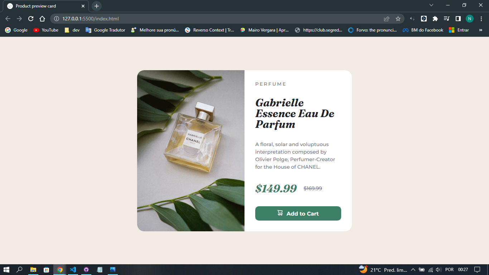

# Product preview card

 Frontend mentor challenge

This is a solution to the [Product preview card component challenge on Frontend Mentor](https://www.frontendmentor.io/challenges/product-preview-card-component-GO7UmttRfa).

### The challenge

Users should be able to:

- View the optimal layout depending on their device's screen size
- See hover and focus states for interactive elements

### Screenshot

### Links

- Live Site URL: <a href="">Click here</a>

### Built with
- HTML5
- CSS3

## Author

- Frontend Mentor - [@nathanfabio](https://www.frontendmentor.io/profile/yourusername)
- Twitter - [@nhfabioo](https://www.twitter.com/nhfabioo)
- GitHub  -  [@nathanfabio](https://github.com/nathanfabio)